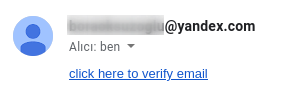

# email-verifier
 
An email verification API example with express and mongoose.

---

## Routes

| Path | Method | Description | Authorization required |
| ----------- | ----------- | ----------- | ----------- |
| /register | POST | Register | false
| /login | POST | Login | false
| /verify | GET | Verify email | false
| /resend | GET | Resend email verification code | true

---

## Development
### Install Repository
```git
git clone https://github.com/boraoksuzoglu/email-verifier
```

### Setup
Create .env file in main folder or rename file named '.env.example' to '.env'
```env
MONGODB_URL=mongodb://localhost:27017/verify-email
PORT=3000
EMAIL_USERNAME=example@yandex.com
EMAIL_PASSWORD=example
EMAIL_SERVICE=Yandex
```
You can set length of verification codes in config.json
```json
{
    "verification_code_length": 4
}
```

### Install node modules
```
npm install
```
### Run!
```
npm run start
```
To start with Nodemon:
```
npm run dev
```

### Finish
```
Your project is running on http://localhost:3000.
```
---
## Images


---

## Developer Notes
- These codes are intended to help during the development stage.
In the production, do not use. 
- I am aware that it is not safe to use the ID (generated by Mongoose) as Bearer Token. This is why I wrote the above note.
- I used Yandex to send mails. If you want to use Yandex, there may be a few settings you need to make. [Click here to see the settings](https://yandex.com/support/mail/mail-clients/others.html).
